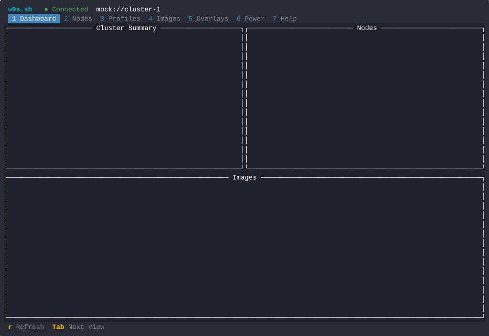

# W9s — The Warewulf Dashboard For Your Terminal

<p align="center">
  <strong>w9s</strong> — a stylish companion to <code>wwctl</code> for managing <a href="https://warewulf.org">Warewulf</a> HPC clusters
</p>

<p align="center">
  <a href="https://github.com/mzaran/w9s/actions/workflows/ci.yml"></a>
  <a href="https://github.com/mzaran/w9s/releases/latest"></a>
  
  <a href="https://opensource.org/licenses/Apache-2.0"></a>
</p>

w9s connects to the [Warewulf](https://github.com/warewulf/warewulf) v4 REST API (v4.4+, recommended v4.6.1+) and gives you a real-time dashboard for cluster provisioning and management. Add nodes, manage profiles, import images, browse overlays, render templates, export data, and switch between clusters — all keyboard-first, no browser needed. Inspired by [k9s](https://k9scli.io/) and [s9s](https://github.com/jontk/s9s).

<p align="center">
  
</p>

## Features

- **Full CRUD** — Add, edit, delete nodes and profiles directly from the TUI
- **Image management** — Import OCI images, build, delete
- **Overlay browser** — Drill into overlay files, render `.ww` templates for specific nodes
- **Column sorting** — Sort any table by any column (`s`/`S`)
- **Live filter** — `/` to filter, Escape to clear
- **CSV export** — `x` exports the current table to a CSV file
- **Multi-cluster** — `Shift+C` to switch between configured clusters
- **Flash messages** — Green/red status bar feedback for all operations
- **Scrollable detail panes** — Full-screen, left-aligned, word-wrapped
- **Keyboard-first** — Works over SSH, no browser needed
- **Single static binary** — `CGO_ENABLED=0`, zero dependencies

## Installation

### Go Install

```bash
go install github.com/mzaran/w9s/cmd/w9s@latest
```

### Binary Download

```bash
curl -LO https://github.com/mzaran/w9s/releases/latest/download/w9s_Linux_x86_64.tar.gz
tar -xzf w9s_Linux_x86_64.tar.gz
sudo mv w9s /usr/local/bin/
```

### RPM / DEB

```bash
sudo rpm -i w9s_*.rpm       # Fedora, RHEL, Rocky
sudo dpkg -i w9s_*.deb      # Debian, Ubuntu
```

### Build from Source

```bash
git clone https://github.com/mzaran/w9s.git
cd w9s
make build
./build/w9s --version
```

## Quick Start

### 1. Configure

Create `~/.config/w9s/config.yaml`:

```yaml
refreshRate: "5s"
defaultCluster: "production"
clusters:
  - name: production
    cluster:
      endpoint: "http://warewulf-server:9873"
      username: "admin"
      password: "changeme"
      timeout: "10s"
  - name: staging
    cluster:
      endpoint: "http://ww-staging:9873"
      username: "admin"
      password: "changeme"
ui:
  enableMouse: true
```

### 2. Run

```bash
w9s                                    # connect to configured cluster
W9S_ENABLE_MOCK=1 w9s --mock          # mock mode (no server needed)
w9s version                            # show version
```

### 3. Environment Variables

| Variable | Description |
|----------|-------------|
| `W9S_ENDPOINT` | Warewulf API endpoint (overrides config) |
| `W9S_USERNAME` | API username |
| `W9S_PASSWORD` | API password |
| `W9S_ENABLE_MOCK` | Set to `1` to allow `--mock` flag |

## Views

| # | View | Description |
|---|------|-------------|
| 1 | **Dashboard** | Cluster overview — node counts, image summary, profile stats |
| 2 | **Nodes** | Node table with CRUD, sort, filter, detail, overlay build |
| 3 | **Profiles** | Profile list with inheritance tree, add/delete |
| 4 | **Images** | Image list with import, build, delete |
| 5 | **Overlays** | Overlay browser — drill into files, render `.ww` templates |
| 6 | **Power** | IPMI power control (requires `wwctl` on PATH) |
| 7 | **Help** | Keyboard shortcuts reference |

## Keyboard Shortcuts

### Global

| Key | Action |
|-----|--------|
| `1`-`7` | Jump to view |
| `Tab` / `Shift+Tab` | Next / previous view |
| `C` (Shift+C) | Switch cluster |
| `?` | Help |
| `q` | Quit |

### Table Views (Nodes, Images, Power)

| Key | Action |
|-----|--------|
| `/` | Open filter (Escape to close) |
| `s` | Sort by next column (▲) |
| `S` | Reverse sort (▼) |
| `Escape` | Reset sort / clear filter |
| `Enter` | View detail (scrollable pane) |
| `x` | Export table to CSV |
| `r` | Refresh data |

### Nodes

| Key | Action |
|-----|--------|
| `a` | Add node (form) |
| `e` | Edit node (form) |
| `d` | Delete node (confirmation) |
| `b` | Build overlays |

### Profiles

| Key | Action |
|-----|--------|
| `a` | Add profile (form) |
| `d` | Delete profile (confirmation) |
| `Enter` | View profile detail |

### Images

| Key | Action |
|-----|--------|
| `i` | Import from OCI registry |
| `b` | Build image |
| `d` | Delete image (confirmation) |

### Overlays

| Key | Action |
|-----|--------|
| `Enter` | Drill into files / view file content |
| `t` | Render `.ww` template for a node |
| `Escape` | Back to overlay list |

## Warewulf Server Setup

w9s connects to the [Warewulf v4 REST API](https://github.com/warewulf/warewulf) (v4.4+, recommended v4.6.1+). Enable it on your server:

```yaml
# /etc/warewulf/warewulf.conf
api:
  enabled: true
  tls: false          # set to true on v4.7+ for TLS
  allowed subnets:
    - "192.168.1.0/24"
    - "127.0.0.0/8"
    - "::1/128"
```

```bash
# Create API credentials
htpasswd -Bc /etc/warewulf/auth.conf admin

# Restart
sudo systemctl restart warewulfd

# Verify
curl -u admin:password http://localhost:9873/api/nodes/
```

> **TLS (Warewulf v4.7+):** Set `tls: true` in warewulf.conf and configure certificates. w9s will connect over HTTPS automatically. Use `--insecure` to skip certificate verification for self-signed certs.

## Development

```bash
make build          # Build binary
make test           # Run all tests
make lint           # golangci-lint
make ci             # lint + test + build
make mock           # Run in mock mode
make dev            # Run with race detector

# Smoke tests (requires tmux)
./test/smoke/verify-views.sh
```

## Architecture

```
cmd/w9s/main.go → cli.Execute()
  → internal/cli/         Cobra CLI, config loading, mock/real client
  → internal/app/         tview lifecycle, keyboard handling, cluster switcher
  → internal/views/       View interface, ResourceView[T] generic, 7 views
  → internal/ui/          Theme, Header, StatusBar, Table, Detail, Form, Confirm
  → internal/dao/         WarewulfClient interface, HTTP client, cache, power
  → internal/config/      Viper YAML, env overrides, auto-detect
  → pkg/mock/             Full mock client with sample HPC cluster data
```

Key pattern: `ResourceView[T]` — each table-based view is ~50 lines of column/action configuration instead of ~1500 lines of repeated boilerplate. Custom views (Dashboard, Profiles, Overlays) implement the `View` interface directly.

## License

Apache 2.0 — see [LICENSE](LICENSE) for details.

---

[w9s.sh](https://w9s.sh)
